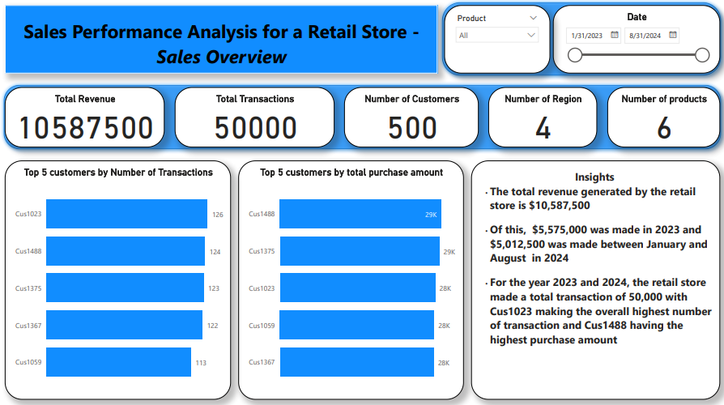
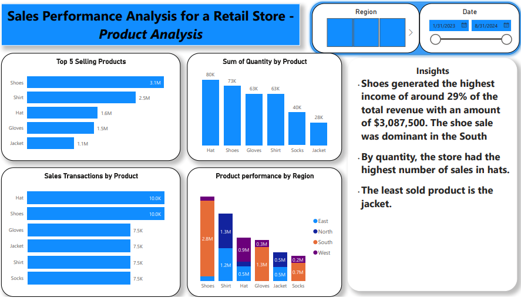
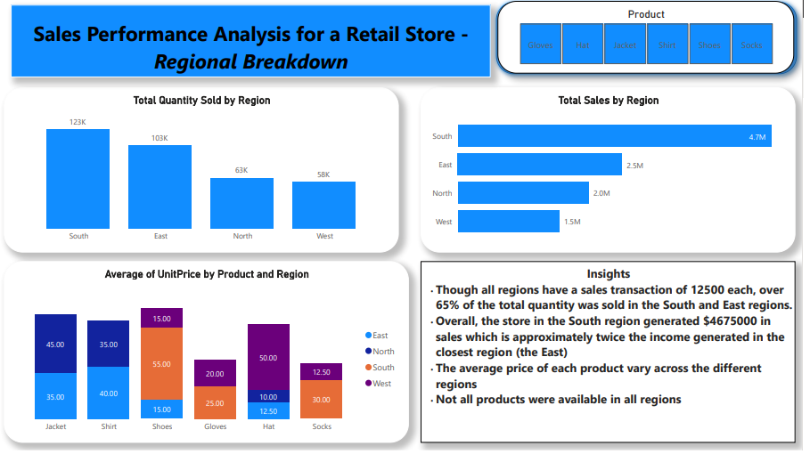

## PROJECT TITLE: SALES PERFORMANCE ANALYSIS FOR A RETAIL STORE

### PROJECT OUTLINE
1. [Project Overview](#project-overview)
2. [Tools Used](#tools-used)
3. [Data Cleaning and Preparation](#data-cleaning-and-preparation)
4. [Exploratory Data Analysis](#exploratory-data-analysis)
5. [Data Analysis](#data-analysis)
6. [Data Visualization](#data-visualization)
7. [Inferences](#inferences)
8. [Conclusion](#conclusion)
9. [Limitations](#limitations)

### Project Overview
In this project, I analyzed the sales performance of a retail store to discover top-selling products, regional performance of products and sales trends.

### TOOLS USED
- Microsoft Excel: For ddata cleaning, creating pivot tables and charts
- SQL: For data manipulation, data retrieval and data analysis
- PoweBI:  Data analysis, visualization and storytelling

### Data Cleaning and Preparation
- Data loading and inspection
- Data cleaning

### EXPLORATORY DATA ANALYSIS
- What is the total sales for each product category?
- What is the number of sales transactions in each region.
- Find the highest-selling product by total sales value.
- What is the total revenue per product?
- Calculate monthly sales totals for the current year.
- Find the top 5 customers by total purchase amount.
- Calculate the percentage of total sales contributed by each region.
- Identify products with no sales in the last quarter
  
### DATA ANALYSIS
- What is the total sales for each product category?

  ```
    ALTER TABLE [dbo].[LITA Capstone Dataset 1]
    ADD Total_Sales int

    UPDATE [dbo].[LITA Capstone Dataset 1]
    SET Total_Sales = Quantity * UnitPrice

    SELECT Product, Sum(Total_Sales) AS Total_Sales FROM [dbo].[LITA Capstone Dataset 1]
    GROUP BY Product
   ```
- What is the number of sales transactions in each region.

```
SELECT Region, COUNT(*) AS Number_of_Sales_Per_Region 
    FROM [dbo].[LITA Capstone Dataset 1]
    GROUP BY Region
```

-  Find the highest-selling product by total sales value.
```
    SELECT TOP 1 Product, Sum(Total_Sales) AS Total_Sales_Value FROM [dbo].[LITA Capstone Dataset 1]
    GROUP BY Product
    ORDER BY Total_Sales_Value DESC
```

- What is the total revenue per product?
```
  SELECT Product, Sum(Total_Sales) AS Total_Revenue FROM [dbo].[LITA Capstone Dataset 1]
  GROUP BY Product
```
    
- Calculate monthly sales totals for the current year.

```
    SELECT YEAR(OrderDate) AS Sales_Year,
    Month(OrderDate) AS Sales_Month,
    SUM(Total_Sales) AS Total_Monthly_Sales
    FROM [dbo].[LITA Capstone Dataset 1]
    WHERE YEAR(OrderDate) = 2024
    GROUP BY YEAR(OrderDate), MONTH(OrderDate)
    ORDER BY Sales_Month 
```

- Find the top 5 customers by total purchase amount.

```
    SELECT TOP 5 Customer_Id, Sum(Total_Sales) AS Total_Purchase_Amount FROM [dbo].[LITA Capstone Dataset 1]
    GROUP BY Customer_Id
    ORDER BY Total_Purchase_Amount DESC
```

- Calculate the percentage of total sales contributed by each region.

```
    SELECT Region, SUM(Total_Sales) AS Sales_Per_Region, (SUM(Total_Sales)*1.0 /(SELECT SUM(Total_Sales)
    FROM [dbo].[LITA Capstone Dataset1]))*100 AS Percentage_of_Total_Sales
    FROM [dbo].[LITA Capstone Dataset 1]
    GROUP BY Region
    ORDER BY Sales_Per_Region DESC
```

- Identify products with no sales in the last quarter

  ```
      SELECT [Product] FROM [dbo].[LITA Capstone Dataset 2] 
      WHERE [Product] NOT IN(
      SELECT [Product] FROM [dbo].[LITA Capstone Dataset 1] WHERE OrderDate >= DATEADD(MONTH, -3, GETDATE()))
   ```
### Data Visualization







### Inferences
1. The total revenue generated by the retail store is $10,587,500
2. Of this, $5,575,000 was made in 2023 and $5,012,500 was made between January and August in 2024
3. For the year 2023 and 2024, the retail store made a total transaction of 50,000 with Cus1023 making the overall highest number of transaction and Cus1488 having the highest purchase amount
4. Shoes generated the highest income of around 29% of the total revenue with an amount of $3,087,500. The shoe sale was dominant in the South 
5. By quantity, the store had the highest number of sales in hats.
6. The least sold product is the jacket.
7. Though all regions have a sales transaction of 12500 each, over 65% of the total quantity was sold in the South and East regions.
8. Overall, the store in the South region generated $4675000 in sales which is approximately twice the income generated in the closest region (the East)
9. The average price of each product vary across the different regions
10. Not all products were available in all regions
    
### Conclusion
Key findings include
1. Shoe is the overall best selling product generating over 44% of the total sales
2. The south region tops in quantity sold and revenue generated
3. The total quantity of products sold per region is directly proportional to the total revenue from each region (in descendig order of sales performance - South, East, North, West )
4. Not all products were sold/available in all the regions
   
### Limitations
1. No information on the availabity of products where their sales were nor recorded
